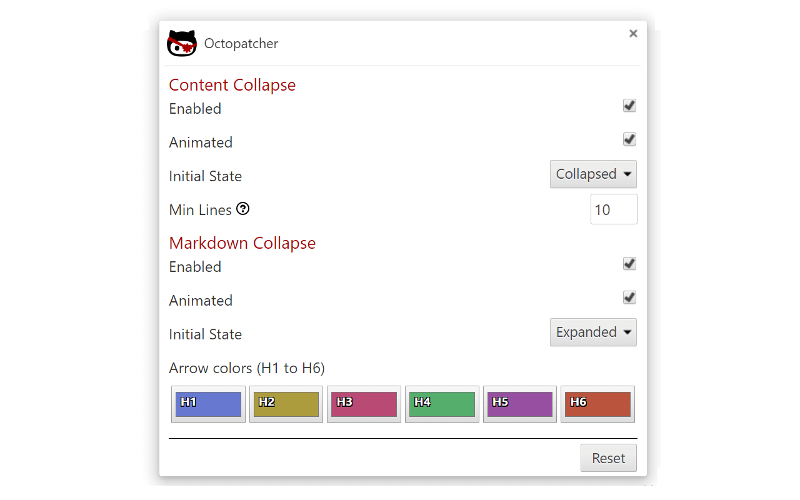

# Octopatcher Settings

:trident: :whale: :dolphin: Arrgh and welcome to the Octopatcher documentation! :anchor: :ship:

Ye can open th' settings page by clickin' th' Chrome extension icon and choosing "options".

The code for this extension is split into different functions - modified from the original userscripts - so, the documentation is also split into those respective sections to ease future expansion of the code and documentation.

All settings are saved to th' cloud to make synching your settings a breeze! :cloud: :cyclone:

Click on the link below to read about the specific functionality of each script.

* [Content Collapse](collapse-comment.md)
* [Markdown Collapse](collapse-markdown.md)

The "Reset" button at the bottom of the page will restore all default settings.

# Change Log

### Version 1.1.0 (4/2/2017)

* Readme: Add link to Opera extension.
* Global:
  * Use improved closest function.
  * Switch to using a single manifest file for all browsers.
  * Change to using "options_ui" instead of deprecated "options_page".
  * Update option page &amp; styling.
  * Update docs.
  * Misc code cleanup.
* Docs:
  * Update settings.
  * Update screenshots.
* Collapsed-Comment:
  * Add comment animation; See [pull #1](https://github.com/Mottie/Octopatcher/pull/1); thanks [@gluons](https://github.com/gluons)!
  * Add animated option to allow toggling.
  * Use pjax & preview event listeners.
* Collapsed-Markdown:
  * Add markdown animation; See [pull #1](https://github.com/Mottie/Octopatcher/pull/1); thanks [@gluons](https://github.com/gluons)!
  * Add animated option to allow toggling.
* Meta:
  * Update dependencies.

### Version 1.0.5 (7/30/2016)

* Add help pages to manifest.

### Version 1.0.4 (7/30/2016)

* Collapsed-Comment:
  * Improve accessibility of headers.
  * Fix squished collaped arrow.
* Collapsed-Markdown:
  * Add support for [GitHub-FixedHeader](https://github.com/StylishThemes/GitHub-FixedHeader) style.
  * Include GitHub help pages.
  * Fix lint & a code tweak.

### Version 1.0.3 (7/20/2016)

* Collapsed-Markdown: Fix squished collapsed arrow.

### Version 1.0.2 (7/5/2016)

* Add support for Firefox.

### Version 1.0.1 (7/4/2016)

* Docs: ye old reset button.
* Grunt: create zip; crx not needed.

### Version 1.0.0 (7/4/2016)

* Initial commit.
