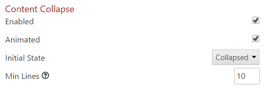
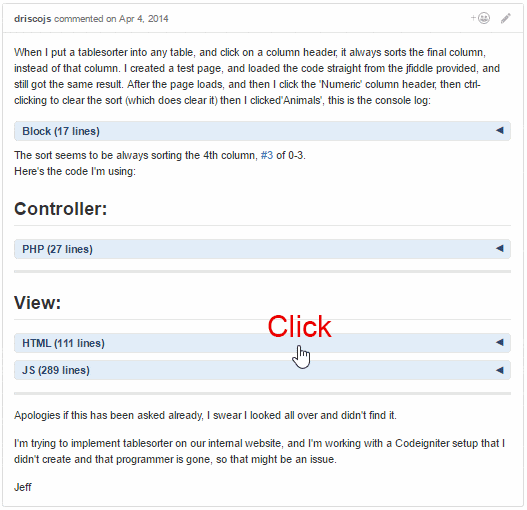

Adds a header that can toggle long code and quote blocks in issue comments

* The block header:
  * Allows the toggling of the long code & quote block, based on a set number of minimum lines.
  * Includes the code language based on the syntax highlighting class name; if highlighting is not applied, "Block" is used as the header name.
  * Includes the number of lines within the block.
* Click the header to toggle the view of the content immediately below the header.
* Use <kbd>Shift</kbd> + Click to toggle the view of all blocks *within the same issue comment*.
* This portion of the Chrome extension was originally written as a [userscript](https://github.com/Mottie/GitHub-userscripts/wiki/GitHub-collapse-in-comment).

## Settings

* "Enabled" - Check to enable (default) the content collapse script.
* "Animated" - Check to enable (default) animation of content; added in v1.1.0.
* "Initial State" - Set to "Collapsed" (default) to have the blocks initially collapsed, or "Expanded" to keep the blocks expanded.
* "Min Lines" - Set the minimum number of lines (`10` by default) that needs to be within a block before a header is added.

## Screenshot

