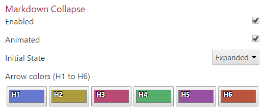
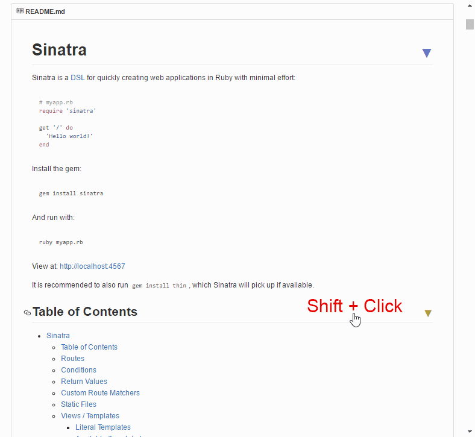

Adds an arrow that can be used to collapse markdown headers

* All markdown headers become clickable and will toggle the view of all content between same level headers (e.g. between H2 headers).
* It works on readme, issues, markdown preview, wiki & gist pages. Pretty much everywhere on GitHub.
* Click on any header to toggle the view of the content below it.
* Use <kbd>Shift</kbd> + Click to toggle the view of *all* same level header content.
* When the content of a header is expanded, all sub-headers are also expanded.
* Links within the header are still clickable.
* Each header level arrow can get a color set making it easier to distinguish header levels.
* This portion of the Chrome extension was originally written as a [userscript](https://github.com/Mottie/GitHub-userscripts/wiki/GitHub-collapse-markdown).

## Settings

* "Enabled" - Check to enable the markdown collapse script.
* "Animated" - Check to enable animation of content; added in v1.1.0.
* "Initial State" - Set to "Collapsed" (default) to have all header content initially collapsed, or "Expanded" to leave the markdown as-is.
* "Arrow Colors" - Click on any of the color swatches to change the arrow color associated with each header (H1 through H6). The default palette was generated from [iwanthue](http://tools.medialab.sciences-po.fr/iwanthue/) using colorblind friendly, soft colors.

## Screenshot

